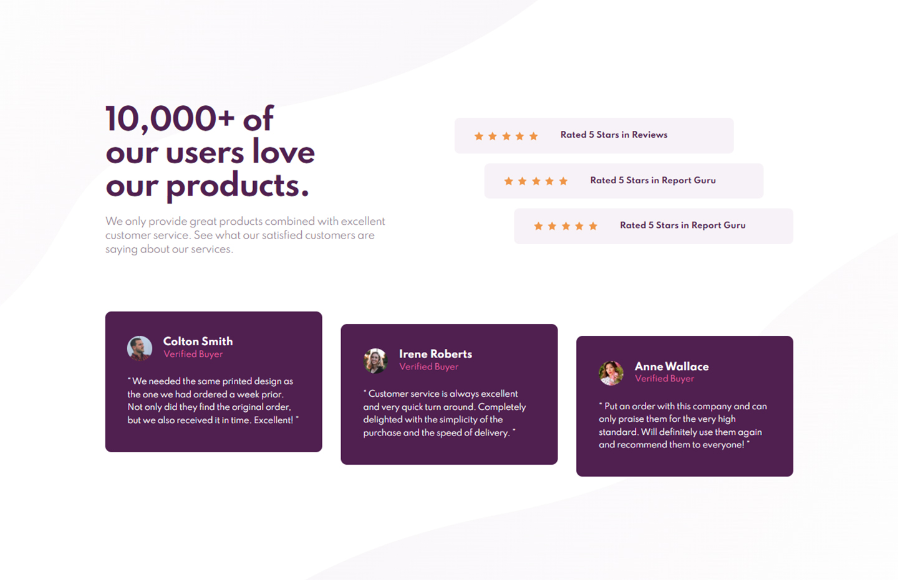

# Frontend Mentor - Social proof section solution

This is a solution to the [Social proof section challenge on Frontend Mentor](https://www.frontendmentor.io/challenges/social-proof-section-6e0qTv_bA). Frontend Mentor challenges help you improve your coding skills by building realistic projects. 

## Table of contents

- [Overview](#overview)
  - [The challenge](#the-challenge)
  - [Screenshot](#screenshot)
  - [Links](#links)
- [My process](#my-process)
  - [Built with](#built-with)
  - [What I learned](#what-i-learned)
  - [Useful resources](#useful-resources)
- [Author](#author)

### Screenshot

### Links

- Solution URL: [Frontend Mentor Solution](https://www.frontendmentor.io/solutions/social-proof-section-pure-css-grid-custom-hover-states-KwSrl-Rjws)
- Live Site URL: [Live Site at Vercel](https://social-proof-section-six-alpha.vercel.app/)
## My process

### Built with

- Semantic HTML5 markup
- BEM
- Grid
- Responsive Design

### What I learned

This challenge help me to use better the "display: grid" and also how to use the percentage to set some div width properly.

### Useful resources

- [BEM 101](https://sparkbox.com/foundry/bem_by_example) - BEM 101

## Author
- Github - [correlucas](https://github.com/correlucas/order-summary-component)
- Frontend Mentor - [@correlucas](https://www.frontendmentor.io/profile/correlucas)
